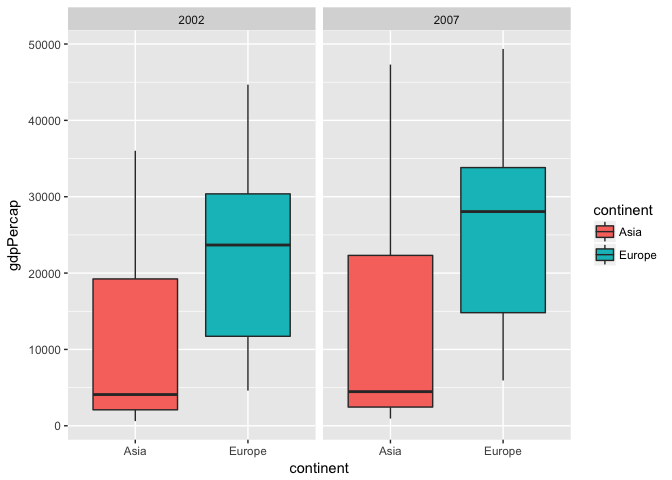

STAT547 Homework 06
================

Overview
--------

I will be working on task 1 Character data, and task 2 Writing functions for this assignment. I wish to practice with string and regular expressions in R, and write some functions.

Task 1 Character data
---------------------

This part follows the instruction of page <https://r4ds.had.co.nz/strings.html>. I found this [link](https://github.com/cimentadaj/R4DS-Solutions/blob/master/ch11.Rmd) very helpful.

### 1.1 Loading packages

``` r
library(tidyverse)
```

    ## ── Attaching packages ────────────────────────────────────────────────────────────── tidyverse 1.2.1 ──

    ## ✔ ggplot2 2.2.1     ✔ purrr   0.2.5
    ## ✔ tibble  1.4.2     ✔ dplyr   0.7.6
    ## ✔ tidyr   0.8.1     ✔ stringr 1.3.1
    ## ✔ readr   1.1.1     ✔ forcats 0.3.0

    ## ── Conflicts ───────────────────────────────────────────────────────────────── tidyverse_conflicts() ──
    ## ✖ dplyr::filter() masks stats::filter()
    ## ✖ dplyr::lag()    masks stats::lag()

``` r
library(stringr)
```

### 1.2 String basics

#### 1.2.1 Material

``` r
string_1 <- "this is a string"
string_1
```

    ## [1] "this is a string"

``` r
double_quote <- "\""
string_2 <- c("this is another string", "\\")
writeLines(string_2)
```

    ## this is another string
    ## \

``` r
string_3 <- c("this is the third string\n", "2")
writeLines(string_3)
```

    ## this is the third string
    ## 
    ## 2

String lenght

``` r
string_4 <- c("ala ma kota","ABC",NA)
str_length(string_4)
```

    ## [1] 11  3 NA

Combining strings

``` r
str_c(string_3, "a")
```

    ## [1] "this is the third string\na" "2a"

``` r
str_c(string_3, "a", sep = ",")
```

    ## [1] "this is the third string\n,a" "2,a"

``` r
# replace nas
str_replace_na(string_4)
```

    ## [1] "ala ma kota" "ABC"         "NA"

``` r
str_c(string_3, string_2, collapse = ",")
```

    ## [1] "this is the third string\nthis is another string,2\\"

Subsetting strings

``` r
string_5 <- c("book", "like", "Sam")
str_sub(string_5, 1, 2)
```

    ## [1] "bo" "li" "Sa"

Locale

``` r
str_to_upper(string_5)
```

    ## [1] "BOOK" "LIKE" "SAM"

#### 1.2.2 Exercise

1.  In your own words, describe the difference between the sep and collapse arguments to str\_c(). sep can seperate two strings using the value that is assigned to sep, and collapse allow us to turn a vector of strings into a single string.

2.  Use str\_length() and str\_sub() to extract the middle character from a string. What will you do if the string has an even number of characters?

``` r
str_sub(string_1, str_length(string_1)/2, str_length(string_1)/2+1)
```

    ## [1] " a"

1.  What does str\_wrap() do? When might you want to use it? It turns a string into several lines of a certain length.

``` r
writeLines(str_wrap(string_1, width = 5))
```

    ## this
    ## is a
    ## string

1.  What does str\_trim() do? What’s the opposite of str\_trim()? It trims the everything rather than character of a string from different directions.

``` r
str_trim(str_c("   ", string_1), side = c("left"))
```

    ## [1] "this is a string"

### 1.3 Matching patterns with regular expressions

#### 1.3.1 Basic matches

``` r
string_6 <- c("google", "guggle", "giggle", "ggplot")
str_view(string_6, "gg")
```

<!--html_preserve-->

<script type="application/json" data-for="htmlwidget-d1f6d9b895450bc3ddad">{"x":{"html":"<ul>\n  <li>google<\/li>\n  <li>gu<span class='match'>gg<\/span>le<\/li>\n  <li>gi<span class='match'>gg<\/span>le<\/li>\n  <li><span class='match'>gg<\/span>plot<\/li>\n<\/ul>"},"evals":[],"jsHooks":[]}</script>
<!--/html_preserve-->
``` r
str_view(string_6, ".g.")
```

<!--html_preserve-->

<script type="application/json" data-for="htmlwidget-bafb0ecd22a9cf9b668c">{"x":{"html":"<ul>\n  <li>go<span class='match'>ogl<\/span>e<\/li>\n  <li>g<span class='match'>ugg<\/span>le<\/li>\n  <li>g<span class='match'>igg<\/span>le<\/li>\n  <li><span class='match'>ggp<\/span>lot<\/li>\n<\/ul>"},"evals":[],"jsHooks":[]}</script>
<!--/html_preserve-->
``` r
str_view(c("abc", "a.c", "bef"), "a\\.c")
```

<!--html_preserve-->

<script type="application/json" data-for="htmlwidget-4b773613afdb6620569e">{"x":{"html":"<ul>\n  <li>abc<\/li>\n  <li><span class='match'>a.c<\/span><\/li>\n  <li>bef<\/li>\n<\/ul>"},"evals":[],"jsHooks":[]}</script>
<!--/html_preserve-->
#### 1.3.1 Exercise

1.  How would you match the sequence "'?

``` r
string_7 <- "a\"'\\b"
writeLines(string_7)
```

    ## a"'\b

``` r
str_view(string_7, "\\\"'\\\\")
```

<!--html_preserve-->

<script type="application/json" data-for="htmlwidget-197b24751bf2db67fa13">{"x":{"html":"<ul>\n  <li>a<span class='match'>\"'\\<\/span>b<\/li>\n<\/ul>"},"evals":[],"jsHooks":[]}</script>
<!--/html_preserve-->
#### 1.3.2 Anchors

``` r
str_view(string_6, "e$")
```

<!--html_preserve-->

<script type="application/json" data-for="htmlwidget-15660b4cbc9be8ec63ca">{"x":{"html":"<ul>\n  <li>googl<span class='match'>e<\/span><\/li>\n  <li>guggl<span class='match'>e<\/span><\/li>\n  <li>giggl<span class='match'>e<\/span><\/li>\n  <li>ggplot<\/li>\n<\/ul>"},"evals":[],"jsHooks":[]}</script>
<!--/html_preserve-->
``` r
str_view(string_6, "^g")
```

<!--html_preserve-->

<script type="application/json" data-for="htmlwidget-1a2a67a725abd2ac05a2">{"x":{"html":"<ul>\n  <li><span class='match'>g<\/span>oogle<\/li>\n  <li><span class='match'>g<\/span>uggle<\/li>\n  <li><span class='match'>g<\/span>iggle<\/li>\n  <li><span class='match'>g<\/span>gplot<\/li>\n<\/ul>"},"evals":[],"jsHooks":[]}</script>
<!--/html_preserve-->
#### 1.3.2 Exercise

1.  How would you match the literal string "$^$"?

``` r
string_8 <- "apple$^$"
string_8
```

    ## [1] "apple$^$"

``` r
str_view(string_8, "\\$\\^\\$")
```

<!--html_preserve-->

<script type="application/json" data-for="htmlwidget-1d78b29e436e71188104">{"x":{"html":"<ul>\n  <li>apple<span class='match'>$^$<\/span><\/li>\n<\/ul>"},"evals":[],"jsHooks":[]}</script>
<!--/html_preserve-->
1.  Given the corpus of common words in stringr::words, create regular expressions that find all words that:

<!-- -->

1.  Start with “y”.
2.  End with “x”
3.  Are exactly three letters long. (Don’t cheat by using str\_length()!)
4.  Have seven letters or more.
5.  Since this list is long, you might want to use the match argument to str\_view() to show only the matching or non-matching words.

``` r
words <- stringr::words
words
```

    ##   [1] "a"           "able"        "about"       "absolute"    "accept"     
    ##   [6] "account"     "achieve"     "across"      "act"         "active"     
    ##  [11] "actual"      "add"         "address"     "admit"       "advertise"  
    ##  [16] "affect"      "afford"      "after"       "afternoon"   "again"      
    ##  [21] "against"     "age"         "agent"       "ago"         "agree"      
    ##  [26] "air"         "all"         "allow"       "almost"      "along"      
    ##  [31] "already"     "alright"     "also"        "although"    "always"     
    ##  [36] "america"     "amount"      "and"         "another"     "answer"     
    ##  [41] "any"         "apart"       "apparent"    "appear"      "apply"      
    ##  [46] "appoint"     "approach"    "appropriate" "area"        "argue"      
    ##  [51] "arm"         "around"      "arrange"     "art"         "as"         
    ##  [56] "ask"         "associate"   "assume"      "at"          "attend"     
    ##  [61] "authority"   "available"   "aware"       "away"        "awful"      
    ##  [66] "baby"        "back"        "bad"         "bag"         "balance"    
    ##  [71] "ball"        "bank"        "bar"         "base"        "basis"      
    ##  [76] "be"          "bear"        "beat"        "beauty"      "because"    
    ##  [81] "become"      "bed"         "before"      "begin"       "behind"     
    ##  [86] "believe"     "benefit"     "best"        "bet"         "between"    
    ##  [91] "big"         "bill"        "birth"       "bit"         "black"      
    ##  [96] "bloke"       "blood"       "blow"        "blue"        "board"      
    ## [101] "boat"        "body"        "book"        "both"        "bother"     
    ## [106] "bottle"      "bottom"      "box"         "boy"         "break"      
    ## [111] "brief"       "brilliant"   "bring"       "britain"     "brother"    
    ## [116] "budget"      "build"       "bus"         "business"    "busy"       
    ## [121] "but"         "buy"         "by"          "cake"        "call"       
    ## [126] "can"         "car"         "card"        "care"        "carry"      
    ## [131] "case"        "cat"         "catch"       "cause"       "cent"       
    ## [136] "centre"      "certain"     "chair"       "chairman"    "chance"     
    ## [141] "change"      "chap"        "character"   "charge"      "cheap"      
    ## [146] "check"       "child"       "choice"      "choose"      "Christ"     
    ## [151] "Christmas"   "church"      "city"        "claim"       "class"      
    ## [156] "clean"       "clear"       "client"      "clock"       "close"      
    ## [161] "closes"      "clothe"      "club"        "coffee"      "cold"       
    ## [166] "colleague"   "collect"     "college"     "colour"      "come"       
    ## [171] "comment"     "commit"      "committee"   "common"      "community"  
    ## [176] "company"     "compare"     "complete"    "compute"     "concern"    
    ## [181] "condition"   "confer"      "consider"    "consult"     "contact"    
    ## [186] "continue"    "contract"    "control"     "converse"    "cook"       
    ## [191] "copy"        "corner"      "correct"     "cost"        "could"      
    ## [196] "council"     "count"       "country"     "county"      "couple"     
    ## [201] "course"      "court"       "cover"       "create"      "cross"      
    ## [206] "cup"         "current"     "cut"         "dad"         "danger"     
    ## [211] "date"        "day"         "dead"        "deal"        "dear"       
    ## [216] "debate"      "decide"      "decision"    "deep"        "definite"   
    ## [221] "degree"      "department"  "depend"      "describe"    "design"     
    ## [226] "detail"      "develop"     "die"         "difference"  "difficult"  
    ## [231] "dinner"      "direct"      "discuss"     "district"    "divide"     
    ## [236] "do"          "doctor"      "document"    "dog"         "door"       
    ## [241] "double"      "doubt"       "down"        "draw"        "dress"      
    ## [246] "drink"       "drive"       "drop"        "dry"         "due"        
    ## [251] "during"      "each"        "early"       "east"        "easy"       
    ## [256] "eat"         "economy"     "educate"     "effect"      "egg"        
    ## [261] "eight"       "either"      "elect"       "electric"    "eleven"     
    ## [266] "else"        "employ"      "encourage"   "end"         "engine"     
    ## [271] "english"     "enjoy"       "enough"      "enter"       "environment"
    ## [276] "equal"       "especial"    "europe"      "even"        "evening"    
    ## [281] "ever"        "every"       "evidence"    "exact"       "example"    
    ## [286] "except"      "excuse"      "exercise"    "exist"       "expect"     
    ## [291] "expense"     "experience"  "explain"     "express"     "extra"      
    ## [296] "eye"         "face"        "fact"        "fair"        "fall"       
    ## [301] "family"      "far"         "farm"        "fast"        "father"     
    ## [306] "favour"      "feed"        "feel"        "few"         "field"      
    ## [311] "fight"       "figure"      "file"        "fill"        "film"       
    ## [316] "final"       "finance"     "find"        "fine"        "finish"     
    ## [321] "fire"        "first"       "fish"        "fit"         "five"       
    ## [326] "flat"        "floor"       "fly"         "follow"      "food"       
    ## [331] "foot"        "for"         "force"       "forget"      "form"       
    ## [336] "fortune"     "forward"     "four"        "france"      "free"       
    ## [341] "friday"      "friend"      "from"        "front"       "full"       
    ## [346] "fun"         "function"    "fund"        "further"     "future"     
    ## [351] "game"        "garden"      "gas"         "general"     "germany"    
    ## [356] "get"         "girl"        "give"        "glass"       "go"         
    ## [361] "god"         "good"        "goodbye"     "govern"      "grand"      
    ## [366] "grant"       "great"       "green"       "ground"      "group"      
    ## [371] "grow"        "guess"       "guy"         "hair"        "half"       
    ## [376] "hall"        "hand"        "hang"        "happen"      "happy"      
    ## [381] "hard"        "hate"        "have"        "he"          "head"       
    ## [386] "health"      "hear"        "heart"       "heat"        "heavy"      
    ## [391] "hell"        "help"        "here"        "high"        "history"    
    ## [396] "hit"         "hold"        "holiday"     "home"        "honest"     
    ## [401] "hope"        "horse"       "hospital"    "hot"         "hour"       
    ## [406] "house"       "how"         "however"     "hullo"       "hundred"    
    ## [411] "husband"     "idea"        "identify"    "if"          "imagine"    
    ## [416] "important"   "improve"     "in"          "include"     "income"     
    ## [421] "increase"    "indeed"      "individual"  "industry"    "inform"     
    ## [426] "inside"      "instead"     "insure"      "interest"    "into"       
    ## [431] "introduce"   "invest"      "involve"     "issue"       "it"         
    ## [436] "item"        "jesus"       "job"         "join"        "judge"      
    ## [441] "jump"        "just"        "keep"        "key"         "kid"        
    ## [446] "kill"        "kind"        "king"        "kitchen"     "knock"      
    ## [451] "know"        "labour"      "lad"         "lady"        "land"       
    ## [456] "language"    "large"       "last"        "late"        "laugh"      
    ## [461] "law"         "lay"         "lead"        "learn"       "leave"      
    ## [466] "left"        "leg"         "less"        "let"         "letter"     
    ## [471] "level"       "lie"         "life"        "light"       "like"       
    ## [476] "likely"      "limit"       "line"        "link"        "list"       
    ## [481] "listen"      "little"      "live"        "load"        "local"      
    ## [486] "lock"        "london"      "long"        "look"        "lord"       
    ## [491] "lose"        "lot"         "love"        "low"         "luck"       
    ## [496] "lunch"       "machine"     "main"        "major"       "make"       
    ## [501] "man"         "manage"      "many"        "mark"        "market"     
    ## [506] "marry"       "match"       "matter"      "may"         "maybe"      
    ## [511] "mean"        "meaning"     "measure"     "meet"        "member"     
    ## [516] "mention"     "middle"      "might"       "mile"        "milk"       
    ## [521] "million"     "mind"        "minister"    "minus"       "minute"     
    ## [526] "miss"        "mister"      "moment"      "monday"      "money"      
    ## [531] "month"       "more"        "morning"     "most"        "mother"     
    ## [536] "motion"      "move"        "mrs"         "much"        "music"      
    ## [541] "must"        "name"        "nation"      "nature"      "near"       
    ## [546] "necessary"   "need"        "never"       "new"         "news"       
    ## [551] "next"        "nice"        "night"       "nine"        "no"         
    ## [556] "non"         "none"        "normal"      "north"       "not"        
    ## [561] "note"        "notice"      "now"         "number"      "obvious"    
    ## [566] "occasion"    "odd"         "of"          "off"         "offer"      
    ## [571] "office"      "often"       "okay"        "old"         "on"         
    ## [576] "once"        "one"         "only"        "open"        "operate"    
    ## [581] "opportunity" "oppose"      "or"          "order"       "organize"   
    ## [586] "original"    "other"       "otherwise"   "ought"       "out"        
    ## [591] "over"        "own"         "pack"        "page"        "paint"      
    ## [596] "pair"        "paper"       "paragraph"   "pardon"      "parent"     
    ## [601] "park"        "part"        "particular"  "party"       "pass"       
    ## [606] "past"        "pay"         "pence"       "pension"     "people"     
    ## [611] "per"         "percent"     "perfect"     "perhaps"     "period"     
    ## [616] "person"      "photograph"  "pick"        "picture"     "piece"      
    ## [621] "place"       "plan"        "play"        "please"      "plus"       
    ## [626] "point"       "police"      "policy"      "politic"     "poor"       
    ## [631] "position"    "positive"    "possible"    "post"        "pound"      
    ## [636] "power"       "practise"    "prepare"     "present"     "press"      
    ## [641] "pressure"    "presume"     "pretty"      "previous"    "price"      
    ## [646] "print"       "private"     "probable"    "problem"     "proceed"    
    ## [651] "process"     "produce"     "product"     "programme"   "project"    
    ## [656] "proper"      "propose"     "protect"     "provide"     "public"     
    ## [661] "pull"        "purpose"     "push"        "put"         "quality"    
    ## [666] "quarter"     "question"    "quick"       "quid"        "quiet"      
    ## [671] "quite"       "radio"       "rail"        "raise"       "range"      
    ## [676] "rate"        "rather"      "read"        "ready"       "real"       
    ## [681] "realise"     "really"      "reason"      "receive"     "recent"     
    ## [686] "reckon"      "recognize"   "recommend"   "record"      "red"        
    ## [691] "reduce"      "refer"       "regard"      "region"      "relation"   
    ## [696] "remember"    "report"      "represent"   "require"     "research"   
    ## [701] "resource"    "respect"     "responsible" "rest"        "result"     
    ## [706] "return"      "rid"         "right"       "ring"        "rise"       
    ## [711] "road"        "role"        "roll"        "room"        "round"      
    ## [716] "rule"        "run"         "safe"        "sale"        "same"       
    ## [721] "saturday"    "save"        "say"         "scheme"      "school"     
    ## [726] "science"     "score"       "scotland"    "seat"        "second"     
    ## [731] "secretary"   "section"     "secure"      "see"         "seem"       
    ## [736] "self"        "sell"        "send"        "sense"       "separate"   
    ## [741] "serious"     "serve"       "service"     "set"         "settle"     
    ## [746] "seven"       "sex"         "shall"       "share"       "she"        
    ## [751] "sheet"       "shoe"        "shoot"       "shop"        "short"      
    ## [756] "should"      "show"        "shut"        "sick"        "side"       
    ## [761] "sign"        "similar"     "simple"      "since"       "sing"       
    ## [766] "single"      "sir"         "sister"      "sit"         "site"       
    ## [771] "situate"     "six"         "size"        "sleep"       "slight"     
    ## [776] "slow"        "small"       "smoke"       "so"          "social"     
    ## [781] "society"     "some"        "son"         "soon"        "sorry"      
    ## [786] "sort"        "sound"       "south"       "space"       "speak"      
    ## [791] "special"     "specific"    "speed"       "spell"       "spend"      
    ## [796] "square"      "staff"       "stage"       "stairs"      "stand"      
    ## [801] "standard"    "start"       "state"       "station"     "stay"       
    ## [806] "step"        "stick"       "still"       "stop"        "story"      
    ## [811] "straight"    "strategy"    "street"      "strike"      "strong"     
    ## [816] "structure"   "student"     "study"       "stuff"       "stupid"     
    ## [821] "subject"     "succeed"     "such"        "sudden"      "suggest"    
    ## [826] "suit"        "summer"      "sun"         "sunday"      "supply"     
    ## [831] "support"     "suppose"     "sure"        "surprise"    "switch"     
    ## [836] "system"      "table"       "take"        "talk"        "tape"       
    ## [841] "tax"         "tea"         "teach"       "team"        "telephone"  
    ## [846] "television"  "tell"        "ten"         "tend"        "term"       
    ## [851] "terrible"    "test"        "than"        "thank"       "the"        
    ## [856] "then"        "there"       "therefore"   "they"        "thing"      
    ## [861] "think"       "thirteen"    "thirty"      "this"        "thou"       
    ## [866] "though"      "thousand"    "three"       "through"     "throw"      
    ## [871] "thursday"    "tie"         "time"        "to"          "today"      
    ## [876] "together"    "tomorrow"    "tonight"     "too"         "top"        
    ## [881] "total"       "touch"       "toward"      "town"        "trade"      
    ## [886] "traffic"     "train"       "transport"   "travel"      "treat"      
    ## [891] "tree"        "trouble"     "true"        "trust"       "try"        
    ## [896] "tuesday"     "turn"        "twelve"      "twenty"      "two"        
    ## [901] "type"        "under"       "understand"  "union"       "unit"       
    ## [906] "unite"       "university"  "unless"      "until"       "up"         
    ## [911] "upon"        "use"         "usual"       "value"       "various"    
    ## [916] "very"        "video"       "view"        "village"     "visit"      
    ## [921] "vote"        "wage"        "wait"        "walk"        "wall"       
    ## [926] "want"        "war"         "warm"        "wash"        "waste"      
    ## [931] "watch"       "water"       "way"         "we"          "wear"       
    ## [936] "wednesday"   "wee"         "week"        "weigh"       "welcome"    
    ## [941] "well"        "west"        "what"        "when"        "where"      
    ## [946] "whether"     "which"       "while"       "white"       "who"        
    ## [951] "whole"       "why"         "wide"        "wife"        "will"       
    ## [956] "win"         "wind"        "window"      "wish"        "with"       
    ## [961] "within"      "without"     "woman"       "wonder"      "wood"       
    ## [966] "word"        "work"        "world"       "worry"       "worse"      
    ## [971] "worth"       "would"       "write"       "wrong"       "year"       
    ## [976] "yes"         "yesterday"   "yet"         "you"         "young"

``` r
(a <- str_view(words, "^y", match = T))
```

<!--html_preserve-->

<script type="application/json" data-for="htmlwidget-9172be5c9440be358952">{"x":{"html":"<ul>\n  <li><span class='match'>y<\/span>ear<\/li>\n  <li><span class='match'>y<\/span>es<\/li>\n  <li><span class='match'>y<\/span>esterday<\/li>\n  <li><span class='match'>y<\/span>et<\/li>\n  <li><span class='match'>y<\/span>ou<\/li>\n  <li><span class='match'>y<\/span>oung<\/li>\n<\/ul>"},"evals":[],"jsHooks":[]}</script>
<!--/html_preserve-->
``` r
(b <- str_view(words, "x$", match = T))
```

<!--html_preserve-->

<script type="application/json" data-for="htmlwidget-035b7ca15134cdfdacb3">{"x":{"html":"<ul>\n  <li>bo<span class='match'>x<\/span><\/li>\n  <li>se<span class='match'>x<\/span><\/li>\n  <li>si<span class='match'>x<\/span><\/li>\n  <li>ta<span class='match'>x<\/span><\/li>\n<\/ul>"},"evals":[],"jsHooks":[]}</script>
<!--/html_preserve-->
``` r
(c <- str_view(words, "^...$", match = T))
```

<!--html_preserve-->

<script type="application/json" data-for="htmlwidget-daf87dbe4be7b2537b66">{"x":{"html":"<ul>\n  <li><span class='match'>act<\/span><\/li>\n  <li><span class='match'>add<\/span><\/li>\n  <li><span class='match'>age<\/span><\/li>\n  <li><span class='match'>ago<\/span><\/li>\n  <li><span class='match'>air<\/span><\/li>\n  <li><span class='match'>all<\/span><\/li>\n  <li><span class='match'>and<\/span><\/li>\n  <li><span class='match'>any<\/span><\/li>\n  <li><span class='match'>arm<\/span><\/li>\n  <li><span class='match'>art<\/span><\/li>\n  <li><span class='match'>ask<\/span><\/li>\n  <li><span class='match'>bad<\/span><\/li>\n  <li><span class='match'>bag<\/span><\/li>\n  <li><span class='match'>bar<\/span><\/li>\n  <li><span class='match'>bed<\/span><\/li>\n  <li><span class='match'>bet<\/span><\/li>\n  <li><span class='match'>big<\/span><\/li>\n  <li><span class='match'>bit<\/span><\/li>\n  <li><span class='match'>box<\/span><\/li>\n  <li><span class='match'>boy<\/span><\/li>\n  <li><span class='match'>bus<\/span><\/li>\n  <li><span class='match'>but<\/span><\/li>\n  <li><span class='match'>buy<\/span><\/li>\n  <li><span class='match'>can<\/span><\/li>\n  <li><span class='match'>car<\/span><\/li>\n  <li><span class='match'>cat<\/span><\/li>\n  <li><span class='match'>cup<\/span><\/li>\n  <li><span class='match'>cut<\/span><\/li>\n  <li><span class='match'>dad<\/span><\/li>\n  <li><span class='match'>day<\/span><\/li>\n  <li><span class='match'>die<\/span><\/li>\n  <li><span class='match'>dog<\/span><\/li>\n  <li><span class='match'>dry<\/span><\/li>\n  <li><span class='match'>due<\/span><\/li>\n  <li><span class='match'>eat<\/span><\/li>\n  <li><span class='match'>egg<\/span><\/li>\n  <li><span class='match'>end<\/span><\/li>\n  <li><span class='match'>eye<\/span><\/li>\n  <li><span class='match'>far<\/span><\/li>\n  <li><span class='match'>few<\/span><\/li>\n  <li><span class='match'>fit<\/span><\/li>\n  <li><span class='match'>fly<\/span><\/li>\n  <li><span class='match'>for<\/span><\/li>\n  <li><span class='match'>fun<\/span><\/li>\n  <li><span class='match'>gas<\/span><\/li>\n  <li><span class='match'>get<\/span><\/li>\n  <li><span class='match'>god<\/span><\/li>\n  <li><span class='match'>guy<\/span><\/li>\n  <li><span class='match'>hit<\/span><\/li>\n  <li><span class='match'>hot<\/span><\/li>\n  <li><span class='match'>how<\/span><\/li>\n  <li><span class='match'>job<\/span><\/li>\n  <li><span class='match'>key<\/span><\/li>\n  <li><span class='match'>kid<\/span><\/li>\n  <li><span class='match'>lad<\/span><\/li>\n  <li><span class='match'>law<\/span><\/li>\n  <li><span class='match'>lay<\/span><\/li>\n  <li><span class='match'>leg<\/span><\/li>\n  <li><span class='match'>let<\/span><\/li>\n  <li><span class='match'>lie<\/span><\/li>\n  <li><span class='match'>lot<\/span><\/li>\n  <li><span class='match'>low<\/span><\/li>\n  <li><span class='match'>man<\/span><\/li>\n  <li><span class='match'>may<\/span><\/li>\n  <li><span class='match'>mrs<\/span><\/li>\n  <li><span class='match'>new<\/span><\/li>\n  <li><span class='match'>non<\/span><\/li>\n  <li><span class='match'>not<\/span><\/li>\n  <li><span class='match'>now<\/span><\/li>\n  <li><span class='match'>odd<\/span><\/li>\n  <li><span class='match'>off<\/span><\/li>\n  <li><span class='match'>old<\/span><\/li>\n  <li><span class='match'>one<\/span><\/li>\n  <li><span class='match'>out<\/span><\/li>\n  <li><span class='match'>own<\/span><\/li>\n  <li><span class='match'>pay<\/span><\/li>\n  <li><span class='match'>per<\/span><\/li>\n  <li><span class='match'>put<\/span><\/li>\n  <li><span class='match'>red<\/span><\/li>\n  <li><span class='match'>rid<\/span><\/li>\n  <li><span class='match'>run<\/span><\/li>\n  <li><span class='match'>say<\/span><\/li>\n  <li><span class='match'>see<\/span><\/li>\n  <li><span class='match'>set<\/span><\/li>\n  <li><span class='match'>sex<\/span><\/li>\n  <li><span class='match'>she<\/span><\/li>\n  <li><span class='match'>sir<\/span><\/li>\n  <li><span class='match'>sit<\/span><\/li>\n  <li><span class='match'>six<\/span><\/li>\n  <li><span class='match'>son<\/span><\/li>\n  <li><span class='match'>sun<\/span><\/li>\n  <li><span class='match'>tax<\/span><\/li>\n  <li><span class='match'>tea<\/span><\/li>\n  <li><span class='match'>ten<\/span><\/li>\n  <li><span class='match'>the<\/span><\/li>\n  <li><span class='match'>tie<\/span><\/li>\n  <li><span class='match'>too<\/span><\/li>\n  <li><span class='match'>top<\/span><\/li>\n  <li><span class='match'>try<\/span><\/li>\n  <li><span class='match'>two<\/span><\/li>\n  <li><span class='match'>use<\/span><\/li>\n  <li><span class='match'>war<\/span><\/li>\n  <li><span class='match'>way<\/span><\/li>\n  <li><span class='match'>wee<\/span><\/li>\n  <li><span class='match'>who<\/span><\/li>\n  <li><span class='match'>why<\/span><\/li>\n  <li><span class='match'>win<\/span><\/li>\n  <li><span class='match'>yes<\/span><\/li>\n  <li><span class='match'>yet<\/span><\/li>\n  <li><span class='match'>you<\/span><\/li>\n<\/ul>"},"evals":[],"jsHooks":[]}</script>
<!--/html_preserve-->
``` r
(d <- str_view(words, "^.......*$", match = T))
```

<!--html_preserve-->

<script type="application/json" data-for="htmlwidget-733fea5f337bfe63ae4c">{"x":{"html":"<ul>\n  <li><span class='match'>absolute<\/span><\/li>\n  <li><span class='match'>accept<\/span><\/li>\n  <li><span class='match'>account<\/span><\/li>\n  <li><span class='match'>achieve<\/span><\/li>\n  <li><span class='match'>across<\/span><\/li>\n  <li><span class='match'>active<\/span><\/li>\n  <li><span class='match'>actual<\/span><\/li>\n  <li><span class='match'>address<\/span><\/li>\n  <li><span class='match'>advertise<\/span><\/li>\n  <li><span class='match'>affect<\/span><\/li>\n  <li><span class='match'>afford<\/span><\/li>\n  <li><span class='match'>afternoon<\/span><\/li>\n  <li><span class='match'>against<\/span><\/li>\n  <li><span class='match'>almost<\/span><\/li>\n  <li><span class='match'>already<\/span><\/li>\n  <li><span class='match'>alright<\/span><\/li>\n  <li><span class='match'>although<\/span><\/li>\n  <li><span class='match'>always<\/span><\/li>\n  <li><span class='match'>america<\/span><\/li>\n  <li><span class='match'>amount<\/span><\/li>\n  <li><span class='match'>another<\/span><\/li>\n  <li><span class='match'>answer<\/span><\/li>\n  <li><span class='match'>apparent<\/span><\/li>\n  <li><span class='match'>appear<\/span><\/li>\n  <li><span class='match'>appoint<\/span><\/li>\n  <li><span class='match'>approach<\/span><\/li>\n  <li><span class='match'>appropriate<\/span><\/li>\n  <li><span class='match'>around<\/span><\/li>\n  <li><span class='match'>arrange<\/span><\/li>\n  <li><span class='match'>associate<\/span><\/li>\n  <li><span class='match'>assume<\/span><\/li>\n  <li><span class='match'>attend<\/span><\/li>\n  <li><span class='match'>authority<\/span><\/li>\n  <li><span class='match'>available<\/span><\/li>\n  <li><span class='match'>balance<\/span><\/li>\n  <li><span class='match'>beauty<\/span><\/li>\n  <li><span class='match'>because<\/span><\/li>\n  <li><span class='match'>become<\/span><\/li>\n  <li><span class='match'>before<\/span><\/li>\n  <li><span class='match'>behind<\/span><\/li>\n  <li><span class='match'>believe<\/span><\/li>\n  <li><span class='match'>benefit<\/span><\/li>\n  <li><span class='match'>between<\/span><\/li>\n  <li><span class='match'>bother<\/span><\/li>\n  <li><span class='match'>bottle<\/span><\/li>\n  <li><span class='match'>bottom<\/span><\/li>\n  <li><span class='match'>brilliant<\/span><\/li>\n  <li><span class='match'>britain<\/span><\/li>\n  <li><span class='match'>brother<\/span><\/li>\n  <li><span class='match'>budget<\/span><\/li>\n  <li><span class='match'>business<\/span><\/li>\n  <li><span class='match'>centre<\/span><\/li>\n  <li><span class='match'>certain<\/span><\/li>\n  <li><span class='match'>chairman<\/span><\/li>\n  <li><span class='match'>chance<\/span><\/li>\n  <li><span class='match'>change<\/span><\/li>\n  <li><span class='match'>character<\/span><\/li>\n  <li><span class='match'>charge<\/span><\/li>\n  <li><span class='match'>choice<\/span><\/li>\n  <li><span class='match'>choose<\/span><\/li>\n  <li><span class='match'>Christ<\/span><\/li>\n  <li><span class='match'>Christmas<\/span><\/li>\n  <li><span class='match'>church<\/span><\/li>\n  <li><span class='match'>client<\/span><\/li>\n  <li><span class='match'>closes<\/span><\/li>\n  <li><span class='match'>clothe<\/span><\/li>\n  <li><span class='match'>coffee<\/span><\/li>\n  <li><span class='match'>colleague<\/span><\/li>\n  <li><span class='match'>collect<\/span><\/li>\n  <li><span class='match'>college<\/span><\/li>\n  <li><span class='match'>colour<\/span><\/li>\n  <li><span class='match'>comment<\/span><\/li>\n  <li><span class='match'>commit<\/span><\/li>\n  <li><span class='match'>committee<\/span><\/li>\n  <li><span class='match'>common<\/span><\/li>\n  <li><span class='match'>community<\/span><\/li>\n  <li><span class='match'>company<\/span><\/li>\n  <li><span class='match'>compare<\/span><\/li>\n  <li><span class='match'>complete<\/span><\/li>\n  <li><span class='match'>compute<\/span><\/li>\n  <li><span class='match'>concern<\/span><\/li>\n  <li><span class='match'>condition<\/span><\/li>\n  <li><span class='match'>confer<\/span><\/li>\n  <li><span class='match'>consider<\/span><\/li>\n  <li><span class='match'>consult<\/span><\/li>\n  <li><span class='match'>contact<\/span><\/li>\n  <li><span class='match'>continue<\/span><\/li>\n  <li><span class='match'>contract<\/span><\/li>\n  <li><span class='match'>control<\/span><\/li>\n  <li><span class='match'>converse<\/span><\/li>\n  <li><span class='match'>corner<\/span><\/li>\n  <li><span class='match'>correct<\/span><\/li>\n  <li><span class='match'>council<\/span><\/li>\n  <li><span class='match'>country<\/span><\/li>\n  <li><span class='match'>county<\/span><\/li>\n  <li><span class='match'>couple<\/span><\/li>\n  <li><span class='match'>course<\/span><\/li>\n  <li><span class='match'>create<\/span><\/li>\n  <li><span class='match'>current<\/span><\/li>\n  <li><span class='match'>danger<\/span><\/li>\n  <li><span class='match'>debate<\/span><\/li>\n  <li><span class='match'>decide<\/span><\/li>\n  <li><span class='match'>decision<\/span><\/li>\n  <li><span class='match'>definite<\/span><\/li>\n  <li><span class='match'>degree<\/span><\/li>\n  <li><span class='match'>department<\/span><\/li>\n  <li><span class='match'>depend<\/span><\/li>\n  <li><span class='match'>describe<\/span><\/li>\n  <li><span class='match'>design<\/span><\/li>\n  <li><span class='match'>detail<\/span><\/li>\n  <li><span class='match'>develop<\/span><\/li>\n  <li><span class='match'>difference<\/span><\/li>\n  <li><span class='match'>difficult<\/span><\/li>\n  <li><span class='match'>dinner<\/span><\/li>\n  <li><span class='match'>direct<\/span><\/li>\n  <li><span class='match'>discuss<\/span><\/li>\n  <li><span class='match'>district<\/span><\/li>\n  <li><span class='match'>divide<\/span><\/li>\n  <li><span class='match'>doctor<\/span><\/li>\n  <li><span class='match'>document<\/span><\/li>\n  <li><span class='match'>double<\/span><\/li>\n  <li><span class='match'>during<\/span><\/li>\n  <li><span class='match'>economy<\/span><\/li>\n  <li><span class='match'>educate<\/span><\/li>\n  <li><span class='match'>effect<\/span><\/li>\n  <li><span class='match'>either<\/span><\/li>\n  <li><span class='match'>electric<\/span><\/li>\n  <li><span class='match'>eleven<\/span><\/li>\n  <li><span class='match'>employ<\/span><\/li>\n  <li><span class='match'>encourage<\/span><\/li>\n  <li><span class='match'>engine<\/span><\/li>\n  <li><span class='match'>english<\/span><\/li>\n  <li><span class='match'>enough<\/span><\/li>\n  <li><span class='match'>environment<\/span><\/li>\n  <li><span class='match'>especial<\/span><\/li>\n  <li><span class='match'>europe<\/span><\/li>\n  <li><span class='match'>evening<\/span><\/li>\n  <li><span class='match'>evidence<\/span><\/li>\n  <li><span class='match'>example<\/span><\/li>\n  <li><span class='match'>except<\/span><\/li>\n  <li><span class='match'>excuse<\/span><\/li>\n  <li><span class='match'>exercise<\/span><\/li>\n  <li><span class='match'>expect<\/span><\/li>\n  <li><span class='match'>expense<\/span><\/li>\n  <li><span class='match'>experience<\/span><\/li>\n  <li><span class='match'>explain<\/span><\/li>\n  <li><span class='match'>express<\/span><\/li>\n  <li><span class='match'>family<\/span><\/li>\n  <li><span class='match'>father<\/span><\/li>\n  <li><span class='match'>favour<\/span><\/li>\n  <li><span class='match'>figure<\/span><\/li>\n  <li><span class='match'>finance<\/span><\/li>\n  <li><span class='match'>finish<\/span><\/li>\n  <li><span class='match'>follow<\/span><\/li>\n  <li><span class='match'>forget<\/span><\/li>\n  <li><span class='match'>fortune<\/span><\/li>\n  <li><span class='match'>forward<\/span><\/li>\n  <li><span class='match'>france<\/span><\/li>\n  <li><span class='match'>friday<\/span><\/li>\n  <li><span class='match'>friend<\/span><\/li>\n  <li><span class='match'>function<\/span><\/li>\n  <li><span class='match'>further<\/span><\/li>\n  <li><span class='match'>future<\/span><\/li>\n  <li><span class='match'>garden<\/span><\/li>\n  <li><span class='match'>general<\/span><\/li>\n  <li><span class='match'>germany<\/span><\/li>\n  <li><span class='match'>goodbye<\/span><\/li>\n  <li><span class='match'>govern<\/span><\/li>\n  <li><span class='match'>ground<\/span><\/li>\n  <li><span class='match'>happen<\/span><\/li>\n  <li><span class='match'>health<\/span><\/li>\n  <li><span class='match'>history<\/span><\/li>\n  <li><span class='match'>holiday<\/span><\/li>\n  <li><span class='match'>honest<\/span><\/li>\n  <li><span class='match'>hospital<\/span><\/li>\n  <li><span class='match'>however<\/span><\/li>\n  <li><span class='match'>hundred<\/span><\/li>\n  <li><span class='match'>husband<\/span><\/li>\n  <li><span class='match'>identify<\/span><\/li>\n  <li><span class='match'>imagine<\/span><\/li>\n  <li><span class='match'>important<\/span><\/li>\n  <li><span class='match'>improve<\/span><\/li>\n  <li><span class='match'>include<\/span><\/li>\n  <li><span class='match'>income<\/span><\/li>\n  <li><span class='match'>increase<\/span><\/li>\n  <li><span class='match'>indeed<\/span><\/li>\n  <li><span class='match'>individual<\/span><\/li>\n  <li><span class='match'>industry<\/span><\/li>\n  <li><span class='match'>inform<\/span><\/li>\n  <li><span class='match'>inside<\/span><\/li>\n  <li><span class='match'>instead<\/span><\/li>\n  <li><span class='match'>insure<\/span><\/li>\n  <li><span class='match'>interest<\/span><\/li>\n  <li><span class='match'>introduce<\/span><\/li>\n  <li><span class='match'>invest<\/span><\/li>\n  <li><span class='match'>involve<\/span><\/li>\n  <li><span class='match'>kitchen<\/span><\/li>\n  <li><span class='match'>labour<\/span><\/li>\n  <li><span class='match'>language<\/span><\/li>\n  <li><span class='match'>letter<\/span><\/li>\n  <li><span class='match'>likely<\/span><\/li>\n  <li><span class='match'>listen<\/span><\/li>\n  <li><span class='match'>little<\/span><\/li>\n  <li><span class='match'>london<\/span><\/li>\n  <li><span class='match'>machine<\/span><\/li>\n  <li><span class='match'>manage<\/span><\/li>\n  <li><span class='match'>market<\/span><\/li>\n  <li><span class='match'>matter<\/span><\/li>\n  <li><span class='match'>meaning<\/span><\/li>\n  <li><span class='match'>measure<\/span><\/li>\n  <li><span class='match'>member<\/span><\/li>\n  <li><span class='match'>mention<\/span><\/li>\n  <li><span class='match'>middle<\/span><\/li>\n  <li><span class='match'>million<\/span><\/li>\n  <li><span class='match'>minister<\/span><\/li>\n  <li><span class='match'>minute<\/span><\/li>\n  <li><span class='match'>mister<\/span><\/li>\n  <li><span class='match'>moment<\/span><\/li>\n  <li><span class='match'>monday<\/span><\/li>\n  <li><span class='match'>morning<\/span><\/li>\n  <li><span class='match'>mother<\/span><\/li>\n  <li><span class='match'>motion<\/span><\/li>\n  <li><span class='match'>nation<\/span><\/li>\n  <li><span class='match'>nature<\/span><\/li>\n  <li><span class='match'>necessary<\/span><\/li>\n  <li><span class='match'>normal<\/span><\/li>\n  <li><span class='match'>notice<\/span><\/li>\n  <li><span class='match'>number<\/span><\/li>\n  <li><span class='match'>obvious<\/span><\/li>\n  <li><span class='match'>occasion<\/span><\/li>\n  <li><span class='match'>office<\/span><\/li>\n  <li><span class='match'>operate<\/span><\/li>\n  <li><span class='match'>opportunity<\/span><\/li>\n  <li><span class='match'>oppose<\/span><\/li>\n  <li><span class='match'>organize<\/span><\/li>\n  <li><span class='match'>original<\/span><\/li>\n  <li><span class='match'>otherwise<\/span><\/li>\n  <li><span class='match'>paragraph<\/span><\/li>\n  <li><span class='match'>pardon<\/span><\/li>\n  <li><span class='match'>parent<\/span><\/li>\n  <li><span class='match'>particular<\/span><\/li>\n  <li><span class='match'>pension<\/span><\/li>\n  <li><span class='match'>people<\/span><\/li>\n  <li><span class='match'>percent<\/span><\/li>\n  <li><span class='match'>perfect<\/span><\/li>\n  <li><span class='match'>perhaps<\/span><\/li>\n  <li><span class='match'>period<\/span><\/li>\n  <li><span class='match'>person<\/span><\/li>\n  <li><span class='match'>photograph<\/span><\/li>\n  <li><span class='match'>picture<\/span><\/li>\n  <li><span class='match'>please<\/span><\/li>\n  <li><span class='match'>police<\/span><\/li>\n  <li><span class='match'>policy<\/span><\/li>\n  <li><span class='match'>politic<\/span><\/li>\n  <li><span class='match'>position<\/span><\/li>\n  <li><span class='match'>positive<\/span><\/li>\n  <li><span class='match'>possible<\/span><\/li>\n  <li><span class='match'>practise<\/span><\/li>\n  <li><span class='match'>prepare<\/span><\/li>\n  <li><span class='match'>present<\/span><\/li>\n  <li><span class='match'>pressure<\/span><\/li>\n  <li><span class='match'>presume<\/span><\/li>\n  <li><span class='match'>pretty<\/span><\/li>\n  <li><span class='match'>previous<\/span><\/li>\n  <li><span class='match'>private<\/span><\/li>\n  <li><span class='match'>probable<\/span><\/li>\n  <li><span class='match'>problem<\/span><\/li>\n  <li><span class='match'>proceed<\/span><\/li>\n  <li><span class='match'>process<\/span><\/li>\n  <li><span class='match'>produce<\/span><\/li>\n  <li><span class='match'>product<\/span><\/li>\n  <li><span class='match'>programme<\/span><\/li>\n  <li><span class='match'>project<\/span><\/li>\n  <li><span class='match'>proper<\/span><\/li>\n  <li><span class='match'>propose<\/span><\/li>\n  <li><span class='match'>protect<\/span><\/li>\n  <li><span class='match'>provide<\/span><\/li>\n  <li><span class='match'>public<\/span><\/li>\n  <li><span class='match'>purpose<\/span><\/li>\n  <li><span class='match'>quality<\/span><\/li>\n  <li><span class='match'>quarter<\/span><\/li>\n  <li><span class='match'>question<\/span><\/li>\n  <li><span class='match'>rather<\/span><\/li>\n  <li><span class='match'>realise<\/span><\/li>\n  <li><span class='match'>really<\/span><\/li>\n  <li><span class='match'>reason<\/span><\/li>\n  <li><span class='match'>receive<\/span><\/li>\n  <li><span class='match'>recent<\/span><\/li>\n  <li><span class='match'>reckon<\/span><\/li>\n  <li><span class='match'>recognize<\/span><\/li>\n  <li><span class='match'>recommend<\/span><\/li>\n  <li><span class='match'>record<\/span><\/li>\n  <li><span class='match'>reduce<\/span><\/li>\n  <li><span class='match'>regard<\/span><\/li>\n  <li><span class='match'>region<\/span><\/li>\n  <li><span class='match'>relation<\/span><\/li>\n  <li><span class='match'>remember<\/span><\/li>\n  <li><span class='match'>report<\/span><\/li>\n  <li><span class='match'>represent<\/span><\/li>\n  <li><span class='match'>require<\/span><\/li>\n  <li><span class='match'>research<\/span><\/li>\n  <li><span class='match'>resource<\/span><\/li>\n  <li><span class='match'>respect<\/span><\/li>\n  <li><span class='match'>responsible<\/span><\/li>\n  <li><span class='match'>result<\/span><\/li>\n  <li><span class='match'>return<\/span><\/li>\n  <li><span class='match'>saturday<\/span><\/li>\n  <li><span class='match'>scheme<\/span><\/li>\n  <li><span class='match'>school<\/span><\/li>\n  <li><span class='match'>science<\/span><\/li>\n  <li><span class='match'>scotland<\/span><\/li>\n  <li><span class='match'>second<\/span><\/li>\n  <li><span class='match'>secretary<\/span><\/li>\n  <li><span class='match'>section<\/span><\/li>\n  <li><span class='match'>secure<\/span><\/li>\n  <li><span class='match'>separate<\/span><\/li>\n  <li><span class='match'>serious<\/span><\/li>\n  <li><span class='match'>service<\/span><\/li>\n  <li><span class='match'>settle<\/span><\/li>\n  <li><span class='match'>should<\/span><\/li>\n  <li><span class='match'>similar<\/span><\/li>\n  <li><span class='match'>simple<\/span><\/li>\n  <li><span class='match'>single<\/span><\/li>\n  <li><span class='match'>sister<\/span><\/li>\n  <li><span class='match'>situate<\/span><\/li>\n  <li><span class='match'>slight<\/span><\/li>\n  <li><span class='match'>social<\/span><\/li>\n  <li><span class='match'>society<\/span><\/li>\n  <li><span class='match'>special<\/span><\/li>\n  <li><span class='match'>specific<\/span><\/li>\n  <li><span class='match'>square<\/span><\/li>\n  <li><span class='match'>stairs<\/span><\/li>\n  <li><span class='match'>standard<\/span><\/li>\n  <li><span class='match'>station<\/span><\/li>\n  <li><span class='match'>straight<\/span><\/li>\n  <li><span class='match'>strategy<\/span><\/li>\n  <li><span class='match'>street<\/span><\/li>\n  <li><span class='match'>strike<\/span><\/li>\n  <li><span class='match'>strong<\/span><\/li>\n  <li><span class='match'>structure<\/span><\/li>\n  <li><span class='match'>student<\/span><\/li>\n  <li><span class='match'>stupid<\/span><\/li>\n  <li><span class='match'>subject<\/span><\/li>\n  <li><span class='match'>succeed<\/span><\/li>\n  <li><span class='match'>sudden<\/span><\/li>\n  <li><span class='match'>suggest<\/span><\/li>\n  <li><span class='match'>summer<\/span><\/li>\n  <li><span class='match'>sunday<\/span><\/li>\n  <li><span class='match'>supply<\/span><\/li>\n  <li><span class='match'>support<\/span><\/li>\n  <li><span class='match'>suppose<\/span><\/li>\n  <li><span class='match'>surprise<\/span><\/li>\n  <li><span class='match'>switch<\/span><\/li>\n  <li><span class='match'>system<\/span><\/li>\n  <li><span class='match'>telephone<\/span><\/li>\n  <li><span class='match'>television<\/span><\/li>\n  <li><span class='match'>terrible<\/span><\/li>\n  <li><span class='match'>therefore<\/span><\/li>\n  <li><span class='match'>thirteen<\/span><\/li>\n  <li><span class='match'>thirty<\/span><\/li>\n  <li><span class='match'>though<\/span><\/li>\n  <li><span class='match'>thousand<\/span><\/li>\n  <li><span class='match'>through<\/span><\/li>\n  <li><span class='match'>thursday<\/span><\/li>\n  <li><span class='match'>together<\/span><\/li>\n  <li><span class='match'>tomorrow<\/span><\/li>\n  <li><span class='match'>tonight<\/span><\/li>\n  <li><span class='match'>toward<\/span><\/li>\n  <li><span class='match'>traffic<\/span><\/li>\n  <li><span class='match'>transport<\/span><\/li>\n  <li><span class='match'>travel<\/span><\/li>\n  <li><span class='match'>trouble<\/span><\/li>\n  <li><span class='match'>tuesday<\/span><\/li>\n  <li><span class='match'>twelve<\/span><\/li>\n  <li><span class='match'>twenty<\/span><\/li>\n  <li><span class='match'>understand<\/span><\/li>\n  <li><span class='match'>university<\/span><\/li>\n  <li><span class='match'>unless<\/span><\/li>\n  <li><span class='match'>various<\/span><\/li>\n  <li><span class='match'>village<\/span><\/li>\n  <li><span class='match'>wednesday<\/span><\/li>\n  <li><span class='match'>welcome<\/span><\/li>\n  <li><span class='match'>whether<\/span><\/li>\n  <li><span class='match'>window<\/span><\/li>\n  <li><span class='match'>within<\/span><\/li>\n  <li><span class='match'>without<\/span><\/li>\n  <li><span class='match'>wonder<\/span><\/li>\n  <li><span class='match'>yesterday<\/span><\/li>\n<\/ul>"},"evals":[],"jsHooks":[]}</script>
<!--/html_preserve-->
#### 1.3.3 Character classes and alternatives

``` r
string_9 <- "UBC STAT 545 abc a*c a.c"
str_view(string_9, "\\d")
```

<!--html_preserve-->

<script type="application/json" data-for="htmlwidget-21f71853111f5c2b3a9d">{"x":{"html":"<ul>\n  <li>UBC STAT <span class='match'>5<\/span>45 abc a*c a.c<\/li>\n<\/ul>"},"evals":[],"jsHooks":[]}</script>
<!--/html_preserve-->
``` r
str_view(string_9, "a[.]c")
```

<!--html_preserve-->

<script type="application/json" data-for="htmlwidget-9fbf2b8bba86a1fb32c1">{"x":{"html":"<ul>\n  <li>UBC STAT 545 abc a*c <span class='match'>a.c<\/span><\/li>\n<\/ul>"},"evals":[],"jsHooks":[]}</script>
<!--/html_preserve-->
``` r
str_view(c("tab", "tap"), "ta(b|p)")
```

<!--html_preserve-->

<script type="application/json" data-for="htmlwidget-c7dcc84ac292c400b90b">{"x":{"html":"<ul>\n  <li><span class='match'>tab<\/span><\/li>\n  <li><span class='match'>tap<\/span><\/li>\n<\/ul>"},"evals":[],"jsHooks":[]}</script>
<!--/html_preserve-->
#### 1.3.3 Exercise

Create regular expressions to find all words that:

1.  Start with a vowel.

2.  That only contain consonants. (Hint: thinking about matching “not”-vowels.)

3.  End with ed, but not with eed.

4.  End with ing or ise.

``` r
string_10 <- c("like", "apple", "true", "kicked", "proceed", "doing", "Spanish")
str_view(string_10, "^[aeiou]")
```

<!--html_preserve-->

<script type="application/json" data-for="htmlwidget-63ed64254b13cb6b6db1">{"x":{"html":"<ul>\n  <li>like<\/li>\n  <li><span class='match'>a<\/span>pple<\/li>\n  <li>true<\/li>\n  <li>kicked<\/li>\n  <li>proceed<\/li>\n  <li>doing<\/li>\n  <li>Spanish<\/li>\n<\/ul>"},"evals":[],"jsHooks":[]}</script>
<!--/html_preserve-->
``` r
str_view(string_10, "[^aeiou]")
```

<!--html_preserve-->

<script type="application/json" data-for="htmlwidget-763060ab0aefe1fca113">{"x":{"html":"<ul>\n  <li><span class='match'>l<\/span>ike<\/li>\n  <li>a<span class='match'>p<\/span>ple<\/li>\n  <li><span class='match'>t<\/span>rue<\/li>\n  <li><span class='match'>k<\/span>icked<\/li>\n  <li><span class='match'>p<\/span>roceed<\/li>\n  <li><span class='match'>d<\/span>oing<\/li>\n  <li><span class='match'>S<\/span>panish<\/li>\n<\/ul>"},"evals":[],"jsHooks":[]}</script>
<!--/html_preserve-->
``` r
str_view(string_10, "[^e]ed$")
```

<!--html_preserve-->

<script type="application/json" data-for="htmlwidget-cc6d161651c62c163f86">{"x":{"html":"<ul>\n  <li>like<\/li>\n  <li>apple<\/li>\n  <li>true<\/li>\n  <li>kic<span class='match'>ked<\/span><\/li>\n  <li>proceed<\/li>\n  <li>doing<\/li>\n  <li>Spanish<\/li>\n<\/ul>"},"evals":[],"jsHooks":[]}</script>
<!--/html_preserve-->
``` r
str_view(string_10, "i(ng|sh)$")
```

<!--html_preserve-->

<script type="application/json" data-for="htmlwidget-bf41db7079f11a16661c">{"x":{"html":"<ul>\n  <li>like<\/li>\n  <li>apple<\/li>\n  <li>true<\/li>\n  <li>kicked<\/li>\n  <li>proceed<\/li>\n  <li>do<span class='match'>ing<\/span><\/li>\n  <li>Span<span class='match'>ish<\/span><\/li>\n<\/ul>"},"evals":[],"jsHooks":[]}</script>
<!--/html_preserve-->
#### 1.3.4 Repetition

``` r
string_dna <- "acgttttgcatctgggggt"
str_view(string_dna, "gg?")
```

<!--html_preserve-->

<script type="application/json" data-for="htmlwidget-4763405e278d9e4a0acb">{"x":{"html":"<ul>\n  <li>ac<span class='match'>g<\/span>ttttgcatctgggggt<\/li>\n<\/ul>"},"evals":[],"jsHooks":[]}</script>
<!--/html_preserve-->
``` r
str_view(string_dna, "gg+")
```

<!--html_preserve-->

<script type="application/json" data-for="htmlwidget-28768ad3099135d69abe">{"x":{"html":"<ul>\n  <li>acgttttgcatct<span class='match'>ggggg<\/span>t<\/li>\n<\/ul>"},"evals":[],"jsHooks":[]}</script>
<!--/html_preserve-->
``` r
str_view(string_dna, "ggg{1}")
```

<!--html_preserve-->

<script type="application/json" data-for="htmlwidget-94cbcfc9534da0381a80">{"x":{"html":"<ul>\n  <li>acgttttgcatct<span class='match'>ggg<\/span>ggt<\/li>\n<\/ul>"},"evals":[],"jsHooks":[]}</script>
<!--/html_preserve-->
``` r
str_view(string_dna, "g{2,}")
```

<!--html_preserve-->

<script type="application/json" data-for="htmlwidget-630766927fca0a01b24b">{"x":{"html":"<ul>\n  <li>acgttttgcatct<span class='match'>ggggg<\/span>t<\/li>\n<\/ul>"},"evals":[],"jsHooks":[]}</script>
<!--/html_preserve-->
#### 1.3.4 Exercise

1.  Describe the equivalents of ?, +, \* in {m,n} form. ? is {,1}

-   is {1,}
-   has no equivalent

1.  Describe in words what these regular expressions match: (read carefully to see if I’m using a regular expression or a string that defines a regular expression.)

^.\*$ \# It matches any string "\\{.+\\}" \# It matches any string with curly braces -- \# It matches numbers in dddd-dd-dd format "\\\\{4}" \# It mathces four backslashes.

1.  Create regular expressions to find all words that:

Start with three consonants.

``` r
str_view(string_10, "^[^aeiou][^aeiou][^aeiou]")
```

<!--html_preserve-->

<script type="application/json" data-for="htmlwidget-28218e1ceba5b01bfede">{"x":{"html":"<ul>\n  <li>like<\/li>\n  <li>apple<\/li>\n  <li>true<\/li>\n  <li>kicked<\/li>\n  <li>proceed<\/li>\n  <li>doing<\/li>\n  <li>Spanish<\/li>\n<\/ul>"},"evals":[],"jsHooks":[]}</script>
<!--/html_preserve-->
Have three or more vowels in a row.

``` r
str_view(string_10, "[aeiou]{3,}")
```

<!--html_preserve-->

<script type="application/json" data-for="htmlwidget-e33bfaf398727853e2ed">{"x":{"html":"<ul>\n  <li>like<\/li>\n  <li>apple<\/li>\n  <li>true<\/li>\n  <li>kicked<\/li>\n  <li>proceed<\/li>\n  <li>doing<\/li>\n  <li>Spanish<\/li>\n<\/ul>"},"evals":[],"jsHooks":[]}</script>
<!--/html_preserve-->
#### 1.3.5 Grouping and backreferences

``` r
string_11 <- c("papas", "ididids", "ududududa", "ababbaba")
str_view(string_11, "(.)(.)\\2\\1")
```

<!--html_preserve-->

<script type="application/json" data-for="htmlwidget-e01ff96463b78bfaa5fa">{"x":{"html":"<ul>\n  <li>papas<\/li>\n  <li>ididids<\/li>\n  <li>ududududa<\/li>\n  <li>ab<span class='match'>abba<\/span>ba<\/li>\n<\/ul>"},"evals":[],"jsHooks":[]}</script>
<!--/html_preserve-->
#### 1.3.5 Exercise

1.  Describe, in words, what these expressions will match:

(.) \# one character repeats for 3 times "(.)(.)\\2\\1" \# two characters followed by the same two characters in reverse order (..) \# two characters repeat once "(.).\\1.\\1" \# one character repeated three times with characters in between each repitition

#### 1.4.1 Detect matches

``` r
string_10
```

    ## [1] "like"    "apple"   "true"    "kicked"  "proceed" "doing"   "Spanish"

``` r
str_detect(string_10, "a")
```

    ## [1] FALSE  TRUE FALSE FALSE FALSE FALSE  TRUE

``` r
sum(str_detect(string_10, "^p"))
```

    ## [1] 1

``` r
mean(str_detect(string_10, "[^aeiou]$"))
```

    ## [1] 0.5714286

``` r
no_vowels <- !str_detect(string_10, "[aeiou]")
no_vowels
```

    ## [1] FALSE FALSE FALSE FALSE FALSE FALSE FALSE

``` r
words[str_detect(words, "ed$")]
```

    ## [1] "bed"     "feed"    "hundred" "indeed"  "need"    "proceed" "red"    
    ## [8] "speed"   "succeed"

``` r
dataframe <- tibble(
  word = words,
  i = seq_along(word)
)
dataframe %>% 
  filter(str_detect(word, "ed$"))
```

    ## # A tibble: 9 x 2
    ##   word        i
    ##   <chr>   <int>
    ## 1 bed        82
    ## 2 feed      307
    ## 3 hundred   410
    ## 4 indeed    422
    ## 5 need      547
    ## 6 proceed   650
    ## 7 red       690
    ## 8 speed     793
    ## 9 succeed   822

``` r
str_count(string_10, "e")
```

    ## [1] 1 1 1 1 2 0 0

``` r
mean(str_count(string_10, "[^aeiou]")) # the mean value of the number of consonants in words
```

    ## [1] 3.285714

``` r
dataframe %>% 
  mutate(
    vowels = str_count(word, "[aeiou]"),
    consonants = str_count(word, "[^aeiou]")
  )
```

    ## # A tibble: 980 x 4
    ##    word         i vowels consonants
    ##    <chr>    <int>  <int>      <int>
    ##  1 a            1      1          0
    ##  2 able         2      2          2
    ##  3 about        3      3          2
    ##  4 absolute     4      4          4
    ##  5 accept       5      2          4
    ##  6 account      6      3          4
    ##  7 achieve      7      4          3
    ##  8 across       8      2          4
    ##  9 act          9      1          2
    ## 10 active      10      3          3
    ## # ... with 970 more rows

#### 1.4.1 Exercise

1.  For each of the following challenges, try solving it by using both a single regular expression, and a combination of multiple str\_detect() calls.

Find all words that start or end with x.

``` r
start_with_x <- str_detect(words, "^x")
end_with_x <- str_detect(words, "x$")
words[start_with_x|end_with_x]
```

    ## [1] "box" "sex" "six" "tax"

Find all words that start with a vowel and end with a consonant.

``` r
start_with_v <- str_detect(words, "^[aeiou]")
end_with_c <- str_detect(words, "[^aeiou]$")
words[start_with_v&end_with_c]
```

    ##   [1] "about"       "accept"      "account"     "across"      "act"        
    ##   [6] "actual"      "add"         "address"     "admit"       "affect"     
    ##  [11] "afford"      "after"       "afternoon"   "again"       "against"    
    ##  [16] "agent"       "air"         "all"         "allow"       "almost"     
    ##  [21] "along"       "already"     "alright"     "although"    "always"     
    ##  [26] "amount"      "and"         "another"     "answer"      "any"        
    ##  [31] "apart"       "apparent"    "appear"      "apply"       "appoint"    
    ##  [36] "approach"    "arm"         "around"      "art"         "as"         
    ##  [41] "ask"         "at"          "attend"      "authority"   "away"       
    ##  [46] "awful"       "each"        "early"       "east"        "easy"       
    ##  [51] "eat"         "economy"     "effect"      "egg"         "eight"      
    ##  [56] "either"      "elect"       "electric"    "eleven"      "employ"     
    ##  [61] "end"         "english"     "enjoy"       "enough"      "enter"      
    ##  [66] "environment" "equal"       "especial"    "even"        "evening"    
    ##  [71] "ever"        "every"       "exact"       "except"      "exist"      
    ##  [76] "expect"      "explain"     "express"     "identify"    "if"         
    ##  [81] "important"   "in"          "indeed"      "individual"  "industry"   
    ##  [86] "inform"      "instead"     "interest"    "invest"      "it"         
    ##  [91] "item"        "obvious"     "occasion"    "odd"         "of"         
    ##  [96] "off"         "offer"       "often"       "okay"        "old"        
    ## [101] "on"          "only"        "open"        "opportunity" "or"         
    ## [106] "order"       "original"    "other"       "ought"       "out"        
    ## [111] "over"        "own"         "under"       "understand"  "union"      
    ## [116] "unit"        "university"  "unless"      "until"       "up"         
    ## [121] "upon"        "usual"

#### 1.4.3 Extract matches

``` r
head(sentences)
```

    ## [1] "The birch canoe slid on the smooth planks." 
    ## [2] "Glue the sheet to the dark blue background."
    ## [3] "It's easy to tell the depth of a well."     
    ## [4] "These days a chicken leg is a rare dish."   
    ## [5] "Rice is often served in round bowls."       
    ## [6] "The juice of lemons makes fine punch."

To find all sentences that contain a color.

``` r
colours <- c("red", "blue", "green", "yellow", "orange", "black")
colour_match <- str_c(colours, collapse = "|")
colour_match
```

    ## [1] "red|blue|green|yellow|orange|black"

``` r
has_color <- str_subset(sentences, colour_match)
matches <- str_extract(has_color, colour_match)
head(matches)
```

    ## [1] "blue" "blue" "red"  "red"  "red"  "blue"

``` r
more <- sentences[str_count(sentences, colour_match) > 1]
str_view_all(more, colour_match)
```

<!--html_preserve-->

<script type="application/json" data-for="htmlwidget-cb16280419903ccd76a2">{"x":{"html":"<ul>\n  <li>It is hard to erase <span class='match'>blue<\/span> or <span class='match'>red<\/span> ink.<\/li>\n  <li>A thick coat of <span class='match'>black<\/span> paint cove<span class='match'>red<\/span> all.<\/li>\n  <li>The <span class='match'>green<\/span> light in the brown box flicke<span class='match'>red<\/span>.<\/li>\n  <li>The sky in the west is tinged with <span class='match'>orange<\/span> <span class='match'>red<\/span>.<\/li>\n<\/ul>"},"evals":[],"jsHooks":[]}</script>
<!--/html_preserve-->
``` r
str_extract_all(more, colour_match, simplify = T)
```

    ##      [,1]     [,2] 
    ## [1,] "blue"   "red"
    ## [2,] "black"  "red"
    ## [3,] "green"  "red"
    ## [4,] "orange" "red"

#### 1.4.3 Exercise

1.  From the Harvard sentences data, extract:

The first word from each sentence.

``` r
first_word <- str_extract(sentences, "^[a-zA-Z]+")
first_word
```

    ##   [1] "The"        "Glue"       "It"         "These"      "Rice"      
    ##   [6] "The"        "The"        "The"        "Four"       "Large"     
    ##  [11] "The"        "A"          "The"        "Kick"       "Help"      
    ##  [16] "A"          "Smoky"      "The"        "The"        "The"       
    ##  [21] "The"        "The"        "Press"      "The"        "The"       
    ##  [26] "Two"        "Her"        "The"        "It"         "Read"      
    ##  [31] "Hoist"      "Take"       "Note"       "Wipe"       "Mend"      
    ##  [36] "The"        "The"        "The"        "The"        "What"      
    ##  [41] "A"          "The"        "Sickness"   "The"        "The"       
    ##  [46] "Lift"       "The"        "Hop"        "The"        "Mesh"      
    ##  [51] "The"        "The"        "Adding"     "The"        "A"         
    ##  [56] "The"        "March"      "A"          "Place"      "Both"      
    ##  [61] "We"         "Use"        "He"         "The"        "A"         
    ##  [66] "Cars"       "The"        "This"       "The"        "Those"     
    ##  [71] "A"          "The"        "The"        "The"        "The"       
    ##  [76] "A"          "The"        "The"        "The"        "The"       
    ##  [81] "The"        "See"        "There"      "The"        "The"       
    ##  [86] "The"        "Cut"        "Men"        "Always"     "He"        
    ##  [91] "The"        "A"          "A"          "The"        "The"       
    ##  [96] "Bail"       "The"        "A"          "Ten"        "The"       
    ## [101] "Oak"        "Cats"       "The"        "Open"       "Add"       
    ## [106] "Thieves"    "The"        "Act"        "The"        "Move"      
    ## [111] "The"        "Leaves"     "The"        "Split"      "Burn"      
    ## [116] "He"         "Weave"      "Hemp"       "A"          "We"        
    ## [121] "Type"       "The"        "The"        "The"        "Paste"     
    ## [126] "The"        "It"         "The"        "Feel"       "The"       
    ## [131] "A"          "He"         "Pluck"      "Two"        "The"       
    ## [136] "Bring"      "Write"      "Clothes"    "We"         "Port"      
    ## [141] "The"        "Guess"      "A"          "The"        "These"     
    ## [146] "Pure"       "The"        "The"        "Mud"        "The"       
    ## [151] "The"        "A"          "He"         "The"        "The"       
    ## [156] "The"        "The"        "We"         "She"        "The"       
    ## [161] "The"        "At"         "Drop"       "A"          "An"        
    ## [166] "Wood"       "The"        "He"         "A"          "A"         
    ## [171] "Steam"      "The"        "There"      "The"        "Torn"      
    ## [176] "Sunday"     "The"        "The"        "They"       "Add"       
    ## [181] "Acid"       "Fairy"      "Eight"      "The"        "A"         
    ## [186] "Add"        "We"         "There"      "He"         "She"       
    ## [191] "The"        "Corn"       "Where"      "The"        "Sell"      
    ## [196] "The"        "The"        "Bring"      "They"       "Farmers"   
    ## [201] "The"        "The"        "Float"      "A"          "A"         
    ## [206] "The"        "After"      "The"        "He"         "Even"      
    ## [211] "The"        "The"        "The"        "Do"         "Lire"      
    ## [216] "The"        "It"         "Write"      "The"        "The"       
    ## [221] "A"          "Coax"       "Schools"    "The"        "They"      
    ## [226] "The"        "The"        "Jazz"       "Rake"       "Slash"     
    ## [231] "Try"        "They"       "He"         "They"       "The"       
    ## [236] "Whitings"   "Some"       "Jerk"       "A"          "Madam"     
    ## [241] "On"         "The"        "This"       "Add"        "The"       
    ## [246] "The"        "The"        "To"         "The"        "Jump"      
    ## [251] "Yell"       "They"       "Both"       "In"         "The"       
    ## [256] "The"        "Ducks"      "Fruit"      "These"      "Canned"    
    ## [261] "The"        "Carry"      "The"        "We"         "Gray"      
    ## [266] "The"        "High"       "Tea"        "A"          "A"         
    ## [271] "The"        "Find"       "Cut"        "The"        "Look"      
    ## [276] "The"        "Nine"       "The"        "The"        "Soak"      
    ## [281] "The"        "A"          "All"        "ii"         "To"        
    ## [286] "Shape"      "The"        "Hedge"      "Quench"     "Tight"     
    ## [291] "The"        "The"        "The"        "Watch"      "The"       
    ## [296] "The"        "Write"      "His"        "The"        "Tin"       
    ## [301] "Slide"      "The"        "The"        "Pink"       "She"       
    ## [306] "The"        "It"         "Let"        "The"        "The"       
    ## [311] "The"        "The"        "The"        "Paper"      "The"       
    ## [316] "The"        "Screw"      "Time"       "The"        "Men"       
    ## [321] "Fill"       "He"         "We"         "Pack"       "The"       
    ## [326] "The"        "Boards"     "The"        "Glass"      "Bathe"     
    ## [331] "Nine"       "The"        "The"        "The"        "Pages"     
    ## [336] "Try"        "Women"      "The"        "A"          "Code"      
    ## [341] "Most"       "He"         "The"        "Mince"      "The"       
    ## [346] "Let"        "A"          "A"          "Tack"       "Next"      
    ## [351] "Pour"       "Each"       "The"        "The"        "The"       
    ## [356] "Just"       "A"          "Our"        "Brass"      "It"        
    ## [361] "Feed"       "The"        "He"         "The"        "Plead"     
    ## [366] "Better"     "This"       "The"        "He"         "Tend"      
    ## [371] "It"         "Mark"       "Take"       "The"        "North"     
    ## [376] "He"         "Go"         "A"          "Soap"       "That"      
    ## [381] "He"         "A"          "Grape"      "Roads"      "Fake"      
    ## [386] "The"        "Smoke"      "Serve"      "Much"       "The"       
    ## [391] "Heave"      "A"          "It"         "His"        "The"       
    ## [396] "The"        "It"         "Beef"       "Raise"      "The"       
    ## [401] "A"          "Jerk"       "No"         "We"         "The"       
    ## [406] "The"        "Three"      "The"        "No"         "Grace"     
    ## [411] "Nudge"      "The"        "Once"       "A"          "Fasten"    
    ## [416] "A"          "He"         "The"        "The"        "There"     
    ## [421] "Seed"       "Draw"       "The"        "The"        "Hats"      
    ## [426] "The"        "Beat"       "Say"        "The"        "Screen"    
    ## [431] "This"       "The"        "He"         "These"      "The"       
    ## [436] "Twist"      "The"        "The"        "Xew"        "The"       
    ## [441] "They"       "The"        "A"          "Breakfast"  "Bottles"   
    ## [446] "The"        "He"         "Drop"       "The"        "Throw"     
    ## [451] "A"          "The"        "The"        "The"        "The"       
    ## [456] "Turn"       "The"        "The"        "To"         "The"       
    ## [461] "The"        "Dispense"   "The"        "He"         "The"       
    ## [466] "The"        "Fly"        "Thick"      "Birth"      "The"       
    ## [471] "The"        "A"          "The"        "We"         "The"       
    ## [476] "The"        "We"         "The"        "Five"       "A"         
    ## [481] "The"        "Shut"       "The"        "Crack"      "He"        
    ## [486] "Send"       "A"          "They"       "The"        "In"        
    ## [491] "A"          "Oats"       "Their"      "The"        "There"     
    ## [496] "Tuck"       "A"          "We"         "The"        "Take"      
    ## [501] "Shake"      "She"        "The"        "The"        "We"        
    ## [506] "Smile"      "A"          "The"        "Take"       "That"      
    ## [511] "The"        "The"        "Ripe"       "A"          "The"       
    ## [516] "The"        "The"        "This"       "She"        "The"       
    ## [521] "Press"      "Neat"       "The"        "The"        "The"       
    ## [526] "Shake"      "The"        "A"          "His"        "Flax"      
    ## [531] "Hurdle"     "A"          "Even"       "Peep"       "The"       
    ## [536] "Cheap"      "A"          "Flood"      "A"          "The"       
    ## [541] "Those"      "He"         "Dill"       "Down"       "Either"    
    ## [546] "The"        "If"         "At"         "Read"       "Fill"      
    ## [551] "The"        "Clams"      "The"        "The"        "Breathe"   
    ## [556] "It"         "A"          "A"          "A"          "A"         
    ## [561] "Paint"      "The"        "Bribes"     "Trample"    "The"       
    ## [566] "A"          "Footprints" "She"        "A"          "Prod"      
    ## [571] "It"         "The"        "It"         "The"        "Wake"      
    ## [576] "The"        "The"        "The"        "Hold"       "Next"      
    ## [581] "Every"      "He"         "They"       "Drive"      "Keep"      
    ## [586] "Sever"      "Paper"      "Slide"      "Help"       "A"         
    ## [591] "Stop"       "Jerk"       "Slidc"      "The"        "Light"     
    ## [596] "Set"        "Dull"       "A"          "Get"        "Choose"    
    ## [601] "A"          "He"         "There"      "The"        "Greet"     
    ## [606] "When"       "Sweet"      "A"          "A"          "Lush"      
    ## [611] "The"        "The"        "The"        "Sit"        "A"         
    ## [616] "The"        "Green"      "Tea"        "Pitch"      "The"       
    ## [621] "The"        "The"        "A"          "The"        "She"       
    ## [626] "The"        "Loop"       "Plead"      "Calves"     "Post"      
    ## [631] "Tear"       "A"          "A"          "It"         "Crouch"    
    ## [636] "Pack"       "The"        "Fine"       "Poached"    "Bad"       
    ## [641] "Ship"       "Dimes"      "They"       "The"        "The"       
    ## [646] "The"        "The"        "Pile"       "The"        "The"       
    ## [651] "The"        "The"        "A"          "The"        "The"       
    ## [656] "To"         "There"      "Cod"        "The"        "Dunk"      
    ## [661] "Hang"       "Cap"        "The"        "Be"         "Pick"      
    ## [666] "A"          "The"        "The"        "The"        "You"       
    ## [671] "Dots"       "Put"        "The"        "The"        "See"       
    ## [676] "Slide"      "Many"       "We"         "No"         "Dig"       
    ## [681] "The"        "A"          "Green"      "A"          "The"       
    ## [686] "A"          "The"        "The"        "Seven"      "Our"       
    ## [691] "The"        "It"         "One"        "Take"       "The"       
    ## [696] "The"        "The"        "Stop"       "The"        "The"       
    ## [701] "Open"       "Fish"       "Dip"        "Will"       "The"       
    ## [706] "The"        "The"        "He"         "Leave"      "The"       
    ## [711] "A"          "The"        "She"        "A"          "Small"     
    ## [716] "The"        "The"        "A"          "She"        "When"

All words ending in ing.

``` r
ing_end <- str_extract(sentences, "\\b[a-zA-Z]+ing\\b")
ing_end[!is.na(ing_end)]
```

    ##  [1] "spring"    "evening"   "morning"   "winding"   "living"   
    ##  [6] "king"      "Adding"    "making"    "raging"    "playing"  
    ## [11] "sleeping"  "ring"      "glaring"   "sinking"   "dying"    
    ## [16] "Bring"     "lodging"   "filing"    "making"    "morning"  
    ## [21] "wearing"   "Bring"     "wading"    "swing"     "nothing"  
    ## [26] "ring"      "morning"   "sing"      "sleeping"  "painting" 
    ## [31] "king"      "walking"   "bring"     "bring"     "shipping" 
    ## [36] "spring"    "ring"      "winding"   "puzzling"  "spring"   
    ## [41] "landing"   "thing"     "waiting"   "whistling" "nothing"  
    ## [46] "timing"    "thing"     "spring"    "changing"  "drenching"
    ## [51] "moving"    "working"   "ring"

#### 1.4.4 Grouped matches

``` r
nouns <- "(a|the) ([^ ]+)"
has_noun <- sentences %>% 
  str_subset(nouns) %>% 
  head(10)
has_noun
```

    ##  [1] "The birch canoe slid on the smooth planks."       
    ##  [2] "Glue the sheet to the dark blue background."      
    ##  [3] "It's easy to tell the depth of a well."           
    ##  [4] "These days a chicken leg is a rare dish."         
    ##  [5] "The box was thrown beside the parked truck."      
    ##  [6] "The boy was there when the sun rose."             
    ##  [7] "The source of the huge river is the clear spring."
    ##  [8] "Kick the ball straight and follow through."       
    ##  [9] "Help the woman get back to her feet."             
    ## [10] "A pot of tea helps to pass the evening."

``` r
has_noun %>% 
  str_extract(nouns)
```

    ##  [1] "the smooth" "the sheet"  "the depth"  "a chicken"  "the parked"
    ##  [6] "the sun"    "the huge"   "the ball"   "the woman"  "a helps"

``` r
has_noun %>% 
  str_match(nouns)
```

    ##       [,1]         [,2]  [,3]     
    ##  [1,] "the smooth" "the" "smooth" 
    ##  [2,] "the sheet"  "the" "sheet"  
    ##  [3,] "the depth"  "the" "depth"  
    ##  [4,] "a chicken"  "a"   "chicken"
    ##  [5,] "the parked" "the" "parked" 
    ##  [6,] "the sun"    "the" "sun"    
    ##  [7,] "the huge"   "the" "huge"   
    ##  [8,] "the ball"   "the" "ball"   
    ##  [9,] "the woman"  "the" "woman"  
    ## [10,] "a helps"    "a"   "helps"

``` r
tibble(sentence = sentences) %>% 
  tidyr::extract(
    sentence, c("article", "noun"), "(a|the) ([^ ]+)", 
    remove = FALSE
  )
```

    ## # A tibble: 720 x 3
    ##    sentence                                    article noun   
    ##    <chr>                                       <chr>   <chr>  
    ##  1 The birch canoe slid on the smooth planks.  the     smooth 
    ##  2 Glue the sheet to the dark blue background. the     sheet  
    ##  3 It's easy to tell the depth of a well.      the     depth  
    ##  4 These days a chicken leg is a rare dish.    a       chicken
    ##  5 Rice is often served in round bowls.        <NA>    <NA>   
    ##  6 The juice of lemons makes fine punch.       <NA>    <NA>   
    ##  7 The box was thrown beside the parked truck. the     parked 
    ##  8 The hogs were fed chopped corn and garbage. <NA>    <NA>   
    ##  9 Four hours of steady work faced us.         <NA>    <NA>   
    ## 10 Large size in stockings is hard to sell.    <NA>    <NA>   
    ## # ... with 710 more rows

#### 1.4.4 Exercise

1.  Find all words that come after a “number” like “one”, “two”, “three” etc. Pull out both the number and the word.

``` r
num <- "(one|two|three|four|five|sex|seven|eight|nine) ([^ ]+)"
has_num <- sentences %>% 
  str_subset(num) %>% 
  head(10)
has_num
```

    ##  [1] "Lift the square stone over the fence."      
    ##  [2] "The rope will bind the seven books at once."
    ##  [3] "The two met while playing on the sand."     
    ##  [4] "There are more than two factors here."      
    ##  [5] "He lay prone and hardly moved a limb."      
    ##  [6] "Type out three lists of orders."            
    ##  [7] "Two plus seven is less than ten."           
    ##  [8] "Drop the two when you add the figures."     
    ##  [9] "Torn scraps littered the stone floor."      
    ## [10] "The lamp shone with a steady green flame."

``` r
has_num %>% 
  str_extract(num)
```

    ##  [1] "one over"    "seven books" "two met"     "two factors" "one and"    
    ##  [6] "three lists" "seven is"    "two when"    "one floor."  "one with"

1.  Find all contractions. Separate out the pieces before and after the apostrophe.

``` r
contract_re <- "([a-zA-Z]+)'([a-zA-Z]+)"
contract <- sentences[str_detect(sentences, contract_re)]
str_match(contract, contract_re)
```

    ##       [,1]         [,2]       [,3]
    ##  [1,] "It's"       "It"       "s" 
    ##  [2,] "man's"      "man"      "s" 
    ##  [3,] "don't"      "don"      "t" 
    ##  [4,] "store's"    "store"    "s" 
    ##  [5,] "workmen's"  "workmen"  "s" 
    ##  [6,] "Let's"      "Let"      "s" 
    ##  [7,] "sun's"      "sun"      "s" 
    ##  [8,] "child's"    "child"    "s" 
    ##  [9,] "king's"     "king"     "s" 
    ## [10,] "It's"       "It"       "s" 
    ## [11,] "don't"      "don"      "t" 
    ## [12,] "queen's"    "queen"    "s" 
    ## [13,] "don't"      "don"      "t" 
    ## [14,] "pirate's"   "pirate"   "s" 
    ## [15,] "neighbor's" "neighbor" "s"

#### 1.4.5 Replacing matches

Replacing some character in a string with some characters

``` r
str_replace(string_10, "[^aeiou]", "-")
```

    ## [1] "-ike"    "a-ple"   "-rue"    "-icked"  "-roceed" "-oing"   "-panish"

``` r
str_replace_all(string_10, "[^aeiou]", "-")
```

    ## [1] "-i-e"    "a---e"   "--ue"    "-i--e-"  "--o-ee-" "-oi--"   "--a-i--"

``` r
string_12 <- c("1 house", "2 cars", "3 people")
str_replace_all(string_12, c("1" = "one", "2" = "two", "3" = "three"))
```

    ## [1] "one house"    "two cars"     "three people"

change the order of the second and the third word using str\_replace

``` r
sentences %>% 
  str_replace("([^ ]+) ([^ ]+) ([^ ]+)", "\\1 \\3 \\2") %>%
  head(3)
```

    ## [1] "The canoe birch slid on the smooth planks." 
    ## [2] "Glue sheet the to the dark blue background."
    ## [3] "It's to easy tell the depth of a well."

#### 1.4.5 exercise

1.  Replace all forward slashes in a string with backslashes.

``` r
string_13 <- c("/1", "/2")
writeLines(string_13)
```

    ## /1
    ## /2

``` r
str_replace(string_13, "/", "\\\\")
```

    ## [1] "\\1" "\\2"

1.  Switch the first and last letters in words. Which of those strings are still words?

``` r
rep_word <- str_replace_all(words, "^([a-z])(.*)([a-z])$", c("\\3\\2\\1"))
head(rep_word)
```

    ## [1] "a"        "ebla"     "tboua"    "ebsoluta" "tccepa"   "tccouna"

#### 1.4.6 Splitting

To tokenize the sentences

``` r
sentences %>% 
  head(10) %>% 
  str_split(" ", simplify = T)
```

    ##       [,1]    [,2]    [,3]    [,4]        [,5]      [,6]    [,7]    
    ##  [1,] "The"   "birch" "canoe" "slid"      "on"      "the"   "smooth"
    ##  [2,] "Glue"  "the"   "sheet" "to"        "the"     "dark"  "blue"  
    ##  [3,] "It's"  "easy"  "to"    "tell"      "the"     "depth" "of"    
    ##  [4,] "These" "days"  "a"     "chicken"   "leg"     "is"    "a"     
    ##  [5,] "Rice"  "is"    "often" "served"    "in"      "round" "bowls."
    ##  [6,] "The"   "juice" "of"    "lemons"    "makes"   "fine"  "punch."
    ##  [7,] "The"   "box"   "was"   "thrown"    "beside"  "the"   "parked"
    ##  [8,] "The"   "hogs"  "were"  "fed"       "chopped" "corn"  "and"   
    ##  [9,] "Four"  "hours" "of"    "steady"    "work"    "faced" "us."   
    ## [10,] "Large" "size"  "in"    "stockings" "is"      "hard"  "to"    
    ##       [,8]          [,9]   
    ##  [1,] "planks."     ""     
    ##  [2,] "background." ""     
    ##  [3,] "a"           "well."
    ##  [4,] "rare"        "dish."
    ##  [5,] ""            ""     
    ##  [6,] ""            ""     
    ##  [7,] "truck."      ""     
    ##  [8,] "garbage."    ""     
    ##  [9,] ""            ""     
    ## [10,] "sell."       ""

``` r
"aa|bb|cc|dd" %>% 
  str_split("\\|") %>% 
  .[[1]]
```

    ## [1] "aa" "bb" "cc" "dd"

To deal with a dictionary

``` r
dic <- c("like:1", "the:2", "you:3")
str_split(dic, ":", n =2, simplify = T)
```

    ##      [,1]   [,2]
    ## [1,] "like" "1" 
    ## [2,] "the"  "2" 
    ## [3,] "you"  "3"

``` r
str_view_all(string_1, boundary("word"))
```

<!--html_preserve-->

<script type="application/json" data-for="htmlwidget-1572ce166096c64adc78">{"x":{"html":"<ul>\n  <li><span class='match'>this<\/span> <span class='match'>is<\/span> <span class='match'>a<\/span> <span class='match'>string<\/span><\/li>\n<\/ul>"},"evals":[],"jsHooks":[]}</script>
<!--/html_preserve-->
``` r
str_split(string_1, boundary("word"))[[1]]
```

    ## [1] "this"   "is"     "a"      "string"

#### 1.4.6 Exercise

1.  Split up a string like "apples, pears, and bananas" into individual components.

``` r
string_14 <- "apples, pears, and bananas"
str_split(string_14, boundary("word"))[[1]]
```

    ## [1] "apples"  "pears"   "and"     "bananas"

What does splitting with an empty string ("") do? Experiment, and then read the documentation. It split every character.

``` r
str_split(string_14, "")[[1]]
```

    ##  [1] "a" "p" "p" "l" "e" "s" "," " " "p" "e" "a" "r" "s" "," " " "a" "n"
    ## [18] "d" " " "b" "a" "n" "a" "n" "a" "s"

#### 14.5 Other types of pattern

``` r
apples <- c("apple","Apple","APPLE")
str_view(apples, regex("apple", ignore_case = T))
```

<!--html_preserve-->

<script type="application/json" data-for="htmlwidget-e6223a01f26a94d40837">{"x":{"html":"<ul>\n  <li><span class='match'>apple<\/span><\/li>\n  <li><span class='match'>Apple<\/span><\/li>\n  <li><span class='match'>APPLE<\/span><\/li>\n<\/ul>"},"evals":[],"jsHooks":[]}</script>
<!--/html_preserve-->
Characters with some diacritics

``` r
ipa1 <- "\u00e1"
ipa2 <- "a\u0301"
c(ipa1, ipa2)
```

    ## [1] "á" "á"

#### 1.4.5 Exercise

What are the five most common words in sentences?

``` r
unlist(str_split(sentences, boundary("word"))) %>% 
  str_to_lower() %>% 
  tibble() %>% 
  set_names("words") %>% 
  count(words) %>% 
  arrange(desc(n)) %>% 
  head(5)
```

    ## # A tibble: 5 x 2
    ##   words     n
    ##   <chr> <int>
    ## 1 the     751
    ## 2 a       202
    ## 3 of      132
    ## 4 to      123
    ## 5 and     118

#### 1.4.6 Other uses of regular expressions

``` r
apropos("replace")
```

    ## [1] "%+replace%"       "replace"          "replace_na"      
    ## [4] "setReplaceMethod" "str_replace"      "str_replace_all" 
    ## [7] "str_replace_na"   "theme_replace"

``` r
#apropos("str")
head(dir(pattern = "\\.Rmd$"))
```

    ## [1] "547hm-06.Rmd"

#### 1.4.7 stringi

Find the stringi functions that:

Count the number of words.

``` r
library(stringi)
stri_count(string_10, regex = "([^ ]+)")
```

    ## [1] 1 1 1 1 1 1 1

Find duplicated strings. stri\_duplicated

Generate random text. stri\_rand\_\* functions

Task 2 Writing functions
------------------------

For this task, I would like to take the GDP per capita of Europe and Asia of the year 2007 and 2002, and wrtie functions that will compare the gdpPercap of these two continent by doing T-test. Further, I will write another function that can plot the gdpPercap and the p value.

To get the data

``` r
library(gapminder)
sub_dat <- gapminder %>% 
  filter(continent %in% c("Europe", "Asia")) %>% 
  filter(year %in% c(2007, 2002))
head(sub_dat)
```

    ## # A tibble: 6 x 6
    ##   country     continent  year lifeExp      pop gdpPercap
    ##   <fct>       <fct>     <int>   <dbl>    <int>     <dbl>
    ## 1 Afghanistan Asia       2002    42.1 25268405      727.
    ## 2 Afghanistan Asia       2007    43.8 31889923      975.
    ## 3 Albania     Europe     2002    75.7  3508512     4604.
    ## 4 Albania     Europe     2007    76.4  3600523     5937.
    ## 5 Austria     Europe     2002    79.0  8148312    32418.
    ## 6 Austria     Europe     2007    79.8  8199783    36126.

``` r
nrow(sub_dat)
```

    ## [1] 126

Write a funtion to do the lmer test that compares the gdpPercap of Asia and Europe (it can be other continent, these two are used here beacuse it has been subseted)in the year 2007 and 2002.

``` r
library(lme4)
```

    ## Loading required package: Matrix

    ## 
    ## Attaching package: 'Matrix'

    ## The following object is masked from 'package:tidyr':
    ## 
    ##     expand

``` r
library(lmerTest)
```

    ## 
    ## Attaching package: 'lmerTest'

    ## The following object is masked from 'package:lme4':
    ## 
    ##     lmer

    ## The following object is masked from 'package:stats':
    ## 
    ##     step

``` r
lmer_test <- function(dat) {
  model = lmer(gdpPercap~continent + (1|year), data = dat)
  return(summary(model))
}
lmer_test(sub_dat)
```

    ## Warning in optwrap(optimizer, devfun, getStart(start, rho$lower, rho$pp), :
    ## convergence code 3 from bobyqa: bobyqa -- a trust region step failed to
    ## reduce q

    ## Linear mixed model fit by REML. t-tests use Satterthwaite's method [
    ## lmerModLmerTest]
    ## Formula: gdpPercap ~ continent + (1 | year)
    ##    Data: dat
    ## 
    ## REML criterion at convergence: 2692.6
    ## 
    ## Scaled residuals: 
    ##     Min      1Q  Median      3Q     Max 
    ## -1.5027 -0.7636 -0.3245  0.7693  2.9220 
    ## 
    ## Random effects:
    ##  Groups   Name        Variance  Std.Dev.
    ##  year     (Intercept)   1576451  1256   
    ##  Residual             146936755 12122   
    ## Number of obs: 126, groups:  year, 2
    ## 
    ## Fixed effects:
    ##                  Estimate Std. Error        df t value Pr(>|t|)    
    ## (Intercept)     11323.559   1736.243     2.373   6.522   0.0145 *  
    ## continentEurope 12059.548   2162.235   123.000   5.577 1.48e-07 ***
    ## ---
    ## Signif. codes:  0 '***' 0.001 '**' 0.01 '*' 0.05 '.' 0.1 ' ' 1
    ## 
    ## Correlation of Fixed Effects:
    ##             (Intr)
    ## continntErp -0.593
    ## convergence code: 3

From the results of the lmer test, we know that the GDP per Capita of Europe in 2002 and 2007 is significantly higher than it of Asia. I would like to write another function to plot the observations of gdpPercap to visulize the difference.

``` r
library(ggplot2)
make_plot <- function(dat){
  plt = ggplot(dat, aes(continent, gdpPercap, fill = continent)) + geom_boxplot() + facet_wrap(~year)
  return(plt)
}
make_plot(sub_dat)
```


